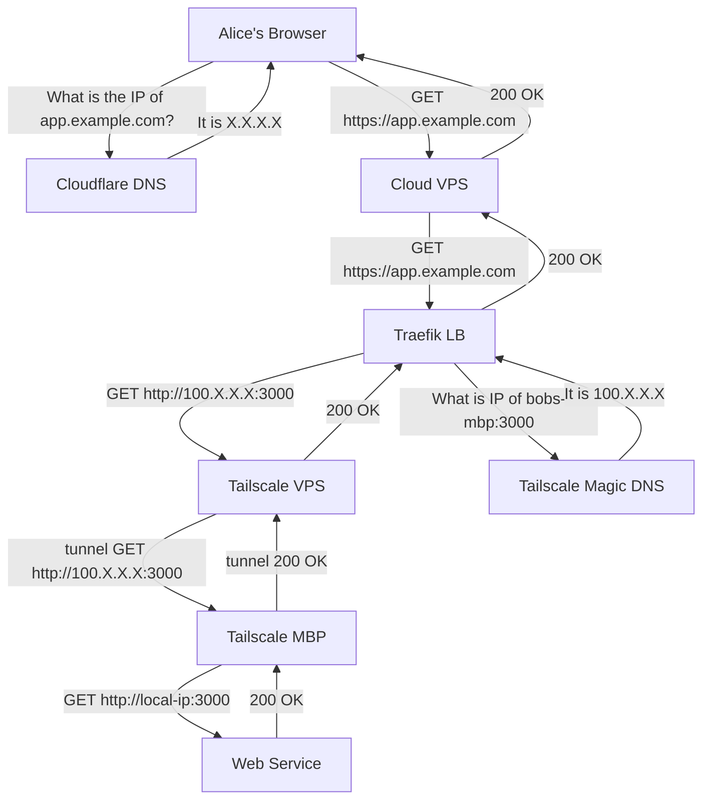

Sometimes while developing you may want to test a callback or share your work over an https connection.
You might have turned to [ngrok](https://ngrok.com) a tool that allows you to create tunnels to your localhost.
Ngrok is a good tool, but to get consistent subdomains you need to pay for a subscription and you only get ngrok domains.
In this post we will see how I setup my own domain and tunnel to a dev server on my laptop using [Tailscale](https://tailscale.com) and a reverse proxy.

## Tailscale - A simpler Wireguard setup

[Tailscale](https://tailscale.com) advertises itself as a "Zero config VPN".
VPN is short for virtual private network and Tailscale implements such a network by building ontop of the Wireguard protocol.
In practice you install the Tailscale software on a device, start the daemon, and complete a login process via a URL.
Behind the scenes Tailscale will set up keys, distribute them to any other devices via their admin server to join the device into your Tailscale network.
This ensures that your new device is accessible from any existing devices in your Tailscale network.
There is of course nothing preventing you from setting up Wireguard on your laptop and server and then handling key creation and IPs yourself.

What makes Tailscale useful is that it sets up an overlay network of sorts by meshing all devices and handling physical IP address changes.
For N devices you dont have to manually set up pairwise connections between all of them, Tailscale handles this for you.
If you run regular Wireguard and wanted a connection from your VPS to your laptop you'd have to update your config everytime your ISP modem changes your IP.

Another nice feature of Tailscale is their magic DNS feature that automatically assigns domains to each of your devices based on their hostnames.
These DNS entries are then available on your Tailscale network interfaces and can be used when you want to access a device in place of their Tailscale IPs.
Say your laptop hostname is `Bobs-MBP`, then Tailscale's magic DNS will make the laptop available as `bobs-mbp` across your devices.

Each device in your Tailscale service can expose "services" which means any network exposed port running on that device.
Essentially if you have an http server listening to port 3000 on your dev machine, the service will be exposed under `bobs-mbp:3000` on your Tailscale network.
If you join both your laptop and a virtual private server in the cloud to your Tailscale network, the VPS would then have access to your laptop's services.

## Exposing your services to the Internet

With the Tailscale explanation out of the way we can move onto the part where I go into the ngrok like setup.
The chart below represents the simplified flow of an HTTPS request to your public domain all the way down to your laptop.



So essentially what happens is that Alice's browser performs an HTTPS request against some domain you have setup, e.g. `app.example.com`.
This domain resolves to the public IP address of a server you control, commonly some kind of VPS.
As the request reaches your VPS it is routed to a load balancer you are running on the VPS, for example Traefik.
The load balancer is then configured to proxy the request to the domain that was generated by Tailscale's magic DNS.
So in the example Traefik resolves `bobs-mbp` to the Tailscale network IP address of the other device and performs a request with that IP.
The Tailscale daemon then handles tunneling that request over its udp tunnel to Bob's MacBook Pro to the web service you're running.

When running Traefik inside a docker container you might create a rule such as this:

```toml
# http routing section
[http]
  [http.routers]
     # Define route to match requests for your domain to a service
     [http.routers.yourapp-dev]
      rule = "Host(`yourapp-dev.example.com`)"
      service = "yourapp-dev"
      # If you want https you need to first configure a certificate resolver which can be used as below
      [http.routers.yourapp-dev.tls]
        certResolver = "letsencrypt"

  # Define a service to handle forwarding the request to your Tailscale domain
  [http.services]
    # Define how to reach an existing service on our infrastructure
    [http.services.yourapp-dev.loadBalancer]
      [[http.services.yourapp-dev.loadBalancer.servers]]
        url = "http://bobs-mbp:3000"
```

## In conclusion

While the setup might look complex from the diagram the process of setting everything up took about an hour of work.
The Tailscale service is simple to install and configure, and you'll get going in almost no time.
Once both my VPS and laptop was enrolled in the Tailscale network and magic DNS had been enabled setting up the proxy was the only thing left to do.

Tailscale, being built on top of the Wireguard protocol, performs really well and more than good enough for a dev environment.
With this approach you can expose your services to the internet in a safe manner on a domain you own.
Shutting down the public access to your service can be done in many ways including:
- disconnecting your laptop from Tailscale, thus shuttign down the tunnel
- removing the proxy in your proxy server config, the tunnel is still there
- using Tailscale ACL config to deny your VPS access to the service, tunnel is there but connections stopped by ACL

In sum I think the setup works well enough that I won't need ngrok.
Additionally Tailscale does more than ngrok and can be used as a traditional VPN when you are on unsecure networks.